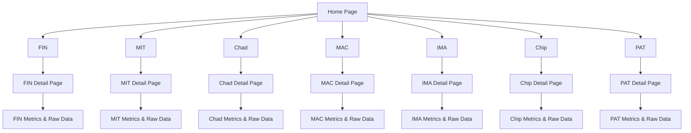

Each Agent will have two metrics for the concept deliverable. One will be using data generated entirely within the agent and one will require data from other agents.

Agents:

# FIN – Finance Automation

### 1. **Total ROI per Campaign** (Self-Generated)

`Total Revenue from Campaign / Total Spend on Campaign`

**Description:**  
This measures how much revenue a campaign generated relative to its cost. FIN calculates both inputs internally using data from CRM and cost platforms.

### 2. **Customer Acquisition Cost (CAC)** (Dependent)  
`Total Spend / Number of New Customers`

**Description:**  
CAC shows how much it costs to acquire one customer. While FIN computes the number, it depends on lead quality and volume from IMA, delivery costs from MAC, and timing/content impact from PAT and Chip.

# MIT – Market Intelligence

### 1. **Signal Ingestion Volume** (Self-Generated)
`Count of raw, unique external signals ingested per period`

**Description:**  
This measures MIT’s core data pipeline — how much market intelligence it’s bringing in. This includes data like firmographic updates, tech installs, trending keywords, job changes, and more. It reflects MIT's operational capacity.

### 2. **Lift from MIT-Informed Campaigns** (Dependent)
`(Performance of MIT-backed campaigns - Baseline performance) / Baseline performance`

**Description:**  
This shows whether campaigns that use MIT's signals actually outperform others. Requires execution by PAT, MAC, and Chip — and tracking by FIN — to compare reply/conversion rates or ROI uplift.

# Chad – Developer Catalyst

### 1. **Workflow Deployment Count** (Self-Generated)  
`Number of new or updated internal workflows deployed`

**Description:**  
Tracks how often Chad is used to build or modify internal systems, UIs, or logic. Reflects its utility in enabling customization without requiring a dev team.

### 2. **Time Saved via Automation** (Dependent)   
`Estimated hours saved based on usage of Chad-built workflows by reps or agents`

**Description:**  
Measures downstream impact of Chad’s work. Requires feedback or data from other agents or users who experience reduced manual steps or increased efficiency.

# MAC – Multi-Channel Activator

### 1. **Outbound Engagement Rate** (Self-Generated)  
`(Total Interactions: opens, clicks, replies, etc.) / (Total Outbound Touches Delivered)`

**Description:**  
Measures how effective MAC’s outreach is across all channels — not just volume, but how often recipients actually engage. Captures overall performance across email, SMS, social, and ads.

### 2. **Engagement Lift from IMA-Qualified Audiences** (Dependent)  
`(Engagement Rate on IMA Leads - Engagement Rate on Non-IMA Leads) / Engagement Rate on Non-IMA Leads`

**Description:**  
Quantifies how much better MAC performs when targeting audiences selected by IMA. A higher lift indicates IMA is surfacing high-quality, high-intent leads that drive stronger engagement across channels.

# IMA – Intent Modeling Agent

### 1. **Intent Classification Accuracy** (Self-Generated)  
`(Number of Correctly Labeled Prospects) / (Total Prospects Scored by IMA)`

**Description:**  
Measures how accurately IMA identifies buyer intent based on behavior, firmographics, and other signals. A “correct” label is one that aligns with the prospect’s eventual engagement or conversion, based on post-hoc validation.

### 2. **Engagement Rate of IMA-Qualified Leads** (Dependent)  
`(Total Engaged IMA Leads) / (Total IMA Leads Touched by Outreach)`

**Description:**  
Assesses how likely IMA-flagged prospects are to engage with MAC- or PAT-triggered outreach. Reflects whether IMA is surfacing truly “ready-to-act” leads or simply active, low-fit ones.

# Chip – Copywriter Bot

### 1. **Message Variant Training Coverage** (Self-Generated)  
`(Number of Outreach Strategies Tested) / (Target Number of Variants per Segment)`  
**Description:**  
Measures how actively Chip is generating and testing message variants across buyer segments. This supports continuous model training and recursive improvement — enabling Chip to learn which tones, structures, and CTAs perform best over time.

### 2. **Engagement Rate Across Chip Variants** (Dependent)  
`(Total Engaged Recipients) / (Total Messages Sent Using Chip’s Content)`  
**Description:**  
Evaluates how effective Chip’s content is across deployed variants. Relies on MAC for delivery and IMA for targeting. Over time, this feedback loop informs Chip’s ability to prioritize high-performing messaging strategies in future drafts.

# PAT – Trigger Engine

### 1. **Trigger-to-Conversion Rate** (Self-Generated)  
`(Conversions from PAT-Triggered Outreach) / (Total PAT Triggers Executed)`  
**Description:**  
Tracks how often PAT’s behavior-based triggers result in meaningful outcomes (e.g., replies, meetings, deals). Measures the effectiveness of PAT’s ability to identify and act on high-intent moments in real time.

### 2. **Conversion Lift Over Non-PAT Sources** (Dependent)  
`(Conversion Rate of PAT Leads - Conversion Rate of Non-PAT Leads) / Conversion Rate of Non-PAT Leads`  
**Description:**  
Compares the performance of PAT-triggered prospects against leads sourced from other agents or methods (e.g., IMA scoring, MIT campaigns, manual lists). A positive lift suggests behavior-based triggers outperform traditional targeting.

