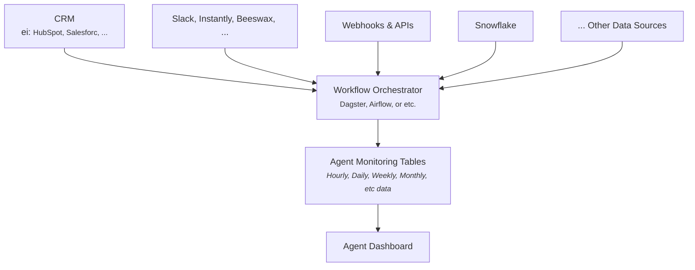
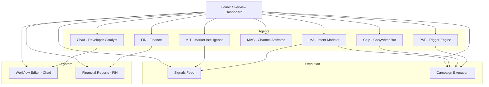

# Agent Monitoring Dashboard

## Backend Flow

<!-- made in react -->
<!-- for each agents
-4 metrics
    -1 primary
    -3 secondary

    consider organizing by time value
    
    follow up notes:
        I think we need to organize this as  -->

## Frontend pages

### Page 1: Overview Metrics
Fin: Finance and Accounting  
<small>Measuring the sales performance via documentation of finalcial data from the GTM strategy.</small>  
<small>Will break down to pre-campaign forecasting vs post-execution. All Quantitative metrics. Performance lies in how accurate projected financial forecasting measures with execution</small>

Pre Sales Campaign Metrics:  
- Forecasting CAC by campgain
- Budget allocation and breakdown
- Burn Rate Forecast

Post Execution Metrics 
- Actual CAC
- Financial reporting and tracking (Burn Rate, live projection modeling, )
- Forecasting Variance (ROI, Payback Period, Reconciliation Rate etc)
- spending reconciliation (add spend, CRM costs, net revenues and expenseses)

MIT: Market research and external market signals
<small> Primarily qualitative metrics describing capturing market trends and shifts to ensure GTM strategy isn't stale.  
These metrics depends on in which vertical the customer competes.  
The reason why I describe this as Qualitative is because this agent's score will be judgement heavy from customer. Do strategists agree with insgihts, are these insights coming in too late? Are segment suggestions relevant? </small>  

Pre sales Campaign: This will compute a single statistic that describes our forecasting for what insights can be gleaned from current market trends. Will be measured against post sales campaign.  
 - Number of actionable insights
 - Segment success projection
 - Metric describing the time delay from market event realization to measurable metric
 - signal to insight ratio

Post Campaign:  
 - Delta from updated GTM strategy (would require a fraction of resources to still target old market for comparable metric)
 - Trend accuracy
 - segment adoption rate
 - Downstream impact score

Chad: Workflow Builder  
<small>Will most likely have to be a comparitive metric within the org to determine increased efficiency of developing internal tools to service sales campaign.  
These will also be primarily Qualitiative metrics and judgement scores from the customer</small>

Post Campaign Metrics:  
 - Uptime / Reliability metrics
 - Adoption rate
 - Using adoption rate calculate resources saved
 - test coverage metrics or error rate

MAC: This guy does the actual outreach.  
<small>Metrics from here will serve IMAs as a test/control dataset and vis versa and IMA is effectively forecasting high value prospects. Fortunately, we don't have to worry about pre vs post campaign metrics as this thing is the abstraction layer for execution.</small>

Quantitative Metrics:  
 - Delivery Rate
 - Engagement rate  
        - open rate  
        - click through rate  
        - reply rate  
        - conversion rate
 - error rate  
        - delivery error
        - channel appropriateness (qual)
        - LLM model effectiveness (qual)
        - compliance incidents

IMA: Identifies high priorty prospects. Main Player.
<small>The purpose of these metrics is to enable lead targeting. Primarily Quantitative using metrics from MAC. The pre and post execution metrics will be integral as they can also be used to update features within the model.</small>

Pre-Campaign:  
 - number of prospects identified
 - number of prospects qualified  
        - value qualifier  
        - segment ID
        - 'freshness' indicator
        - MIT score
 - Customer Judgement score (qual)

Post Campaign:  
 - Conversion rate (MAC metric required)
 - Accuracy of prospect qualifier metric
    - false positive rate
    - false segment analysis or signal ID
 - Win Rate
 - Live rep comparison (number of prospects missed by live reps)
 - Judgment score (feedback from rep)

### Page 2: Delivery Metrics
notes:
- How does a delivery destination affect a workflow?  For example, Slack vs Hubspot vs Instantly
### Page 3:

## My Thoughts:
I need to further understand exactly what each agent is going to do. How can we do this?
- Brad, has a couple of vague emails (i do not know the terms well)
- Andrew, Previous conversations with Jim
- Andrew, Slides that jim has shared
- Look at prospectdesk.ai website for a specific agents. 

The ultimate goal is to drive more sales. How can we communicate this through a dashboard?
- People care about money, translate to money where ever feasible.
- We need to compare the agent vs traditional methods. 
- We need to communicate that meaningful leads work down the sales funnel.
    - Probabilty lead results in a sale?

What should we communicate with charts? what needs to be time series? what should be a graph, table, etc

### SDR key metrics
How should we split this across the different pages in the dashboard? 
how can we show this as a flow? I want a nice visual flow of the SDR process. Maybe we could have a graph visual showing all of this, then you can click in.

**Activity Metrics:**
- Calls made per day/week
- Emails sent per day/week
- LinkedIn connection requests and messages
- Social touches (social media interactions)

**Response & Engagement Metrics:**
- Email open rates and reply rates
- Call connect rates (percentage of calls that reach a live person)
- Response rates across all channels
- Conversation rates (meaningful two-way interactions)

**Pipeline Generation:**
- Qualified leads generated (SQLs - Sales Qualified Leads)
- Meetings booked/scheduled
- Opportunities created
- Pipeline value generated

**Conversion Metrics:**
- Lead-to-meeting conversion rate
- Meeting-to-opportunity conversion rate
- Activity-to-SQL conversion rate
- Time to first meeting from initial contact

**Quality Metrics:**
- Meeting show rate (percentage of scheduled meetings that actually happen)
- Meeting acceptance rate by Account Executives
- Lead quality scores from sales team feedback

**Efficiency Metrics:**
- Average time to respond to inbound leads
- Time spent on each activity type
- Cost per lead generated
- Revenue per SDR (if tracking closed deals)

###