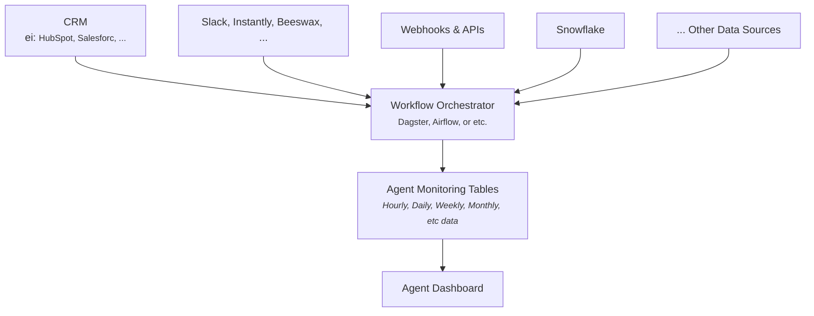

# Agent Monitoring Dashboard

## Backend Flow

## Frontend pages
### Page 1: Overview Metrics

## My Thoughts:
I need to further understand exactly what each agent is going to do. How can we do this?
- Brad, has a couple of vague emails (i do not know the terms well)
- Andrew, Previous conversations with Jim
- Andrew, Slides that jim has shared
- Look at prospectdesk.ai website for a specific agents. 

The ultimate goal is to drive more sales. How can we communicate this through a dashboard?
- People care about money, translate to money where ever feasible.
- We need to compare the agent vs traditional methods. 
- We need to communicate that meaningful leads work down the sales funnel.
    - Probabilty lead results in a sale?

What should we communicate with charts? what needs to be time series? what should be a graph, table, etc

### SDR key metrics
How should we split this across the different pages in the dashboard? 
how can we show this as a flow? I want a nice visual flow of the SDR process. Maybe we could have a graph visual showing all of this, then you can click in.

**Activity Metrics:**
- Calls made per day/week
- Emails sent per day/week
- LinkedIn connection requests and messages
- Social touches (social media interactions)

**Response & Engagement Metrics:**
- Email open rates and reply rates
- Call connect rates (percentage of calls that reach a live person)
- Response rates across all channels
- Conversation rates (meaningful two-way interactions)

**Pipeline Generation:**
- Qualified leads generated (SQLs - Sales Qualified Leads)
- Meetings booked/scheduled
- Opportunities created
- Pipeline value generated

**Conversion Metrics:**
- Lead-to-meeting conversion rate
- Meeting-to-opportunity conversion rate
- Activity-to-SQL conversion rate
- Time to first meeting from initial contact

**Quality Metrics:**
- Meeting show rate (percentage of scheduled meetings that actually happen)
- Meeting acceptance rate by Account Executives
- Lead quality scores from sales team feedback

**Efficiency Metrics:**
- Average time to respond to inbound leads
- Time spent on each activity type
- Cost per lead generated
- Revenue per SDR (if tracking closed deals)

###